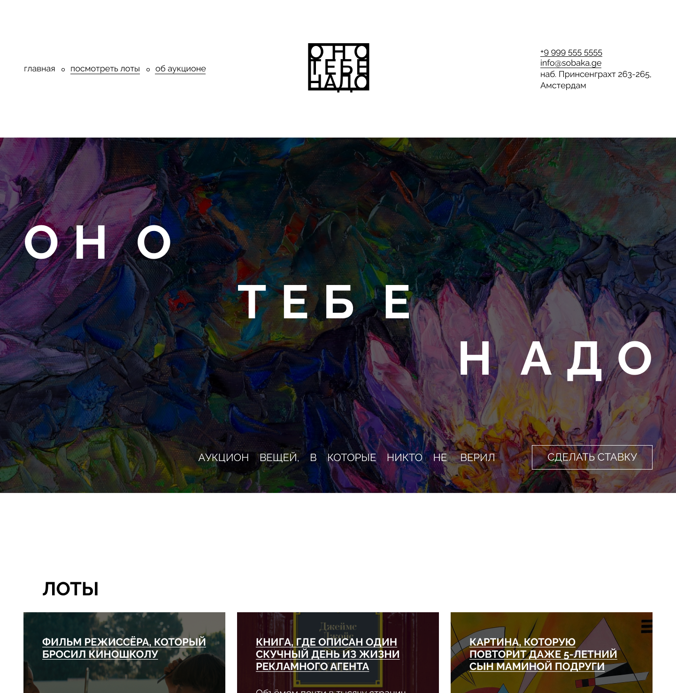

<h1>Оно тебе надо</h1>

<h2>Описание</h2>

Одностраничный сайт для большого монитора. Сверстан под ширину экрана минимум 1100px. Посвящен аукциону различных достижений культуры, которые когда-то были непоняты и неприняты обществом, однако спустя время получили признание.

Структура:

<ul>
  <li>шапка с навигацией, логотипом и блоком с адресом;</li>
  <li>три секции: входная, с карточками и об аукционе;</li>
  <li>подвал с блоком с адресом, навигацией и ссылками на сторонние ресурсы.</li>
</ul>

P.S. пути перехода по ссылкам не прописаны.

<h2>Технологии</h2>
<ul>
  <li>HTML (семантическая верстка);</li>
  <li>CSS (flexbox, grid layout);</li>
  <li>БЭМ.</li>
</ul>
<h2>Ссылка на макет</h2>
<a href="https://www.figma.com/file/86V7ulT3VX5l4nG2wq9VkQ/2-Оно-тебе-надо-Copy?fuid=997588057117138482">Открыть</a>
<h2>Ссылка на проект</h2>
<a href="https://juliadik.github.io/ono-tebe-nado-main/index.html">Открыть</a>